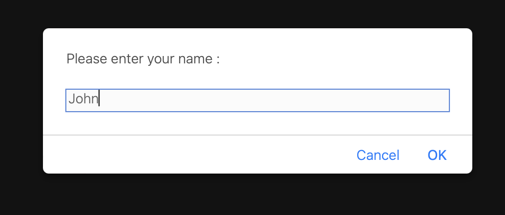
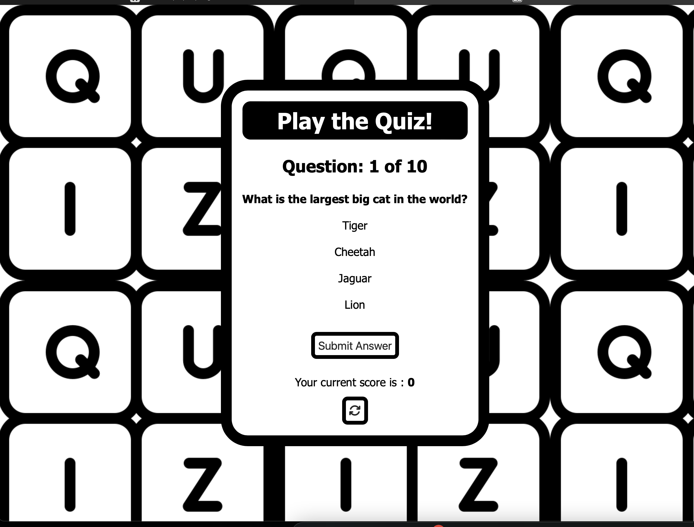
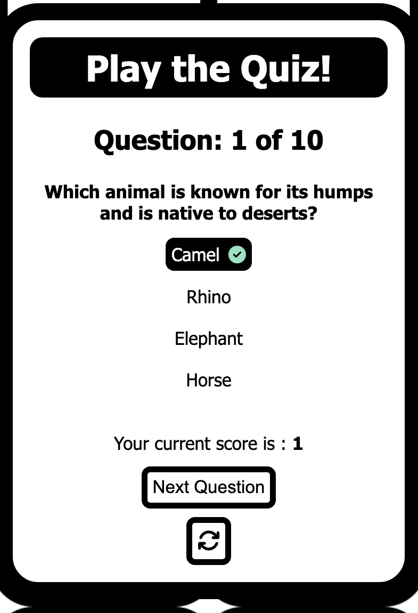
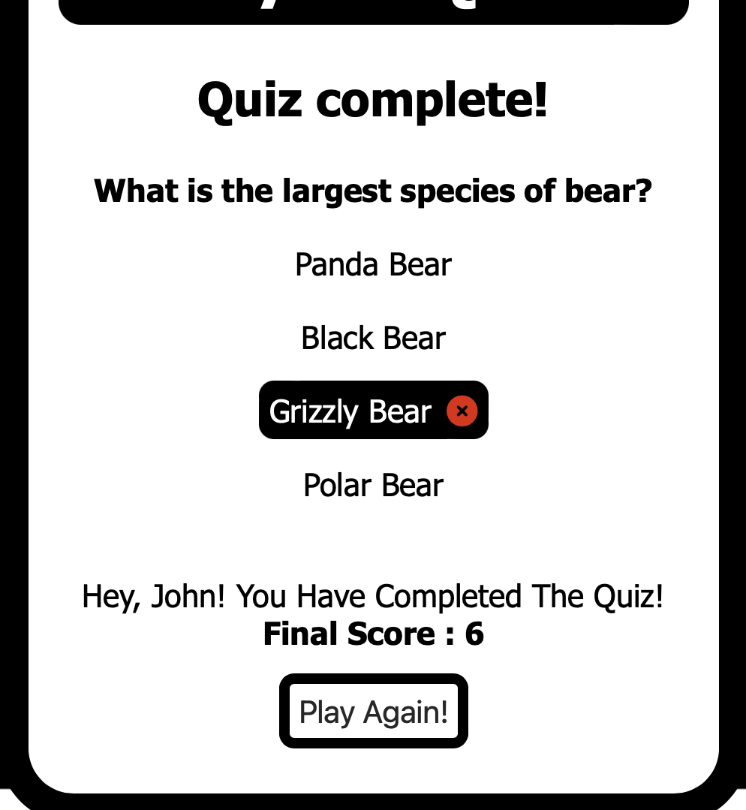
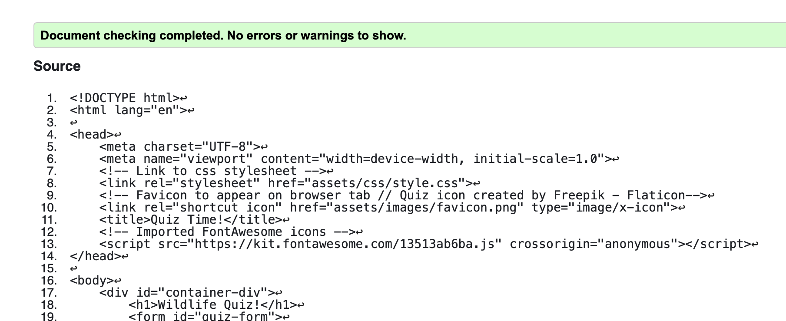
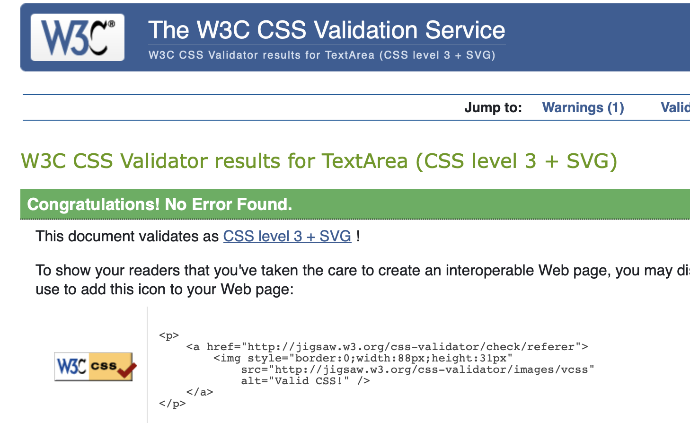
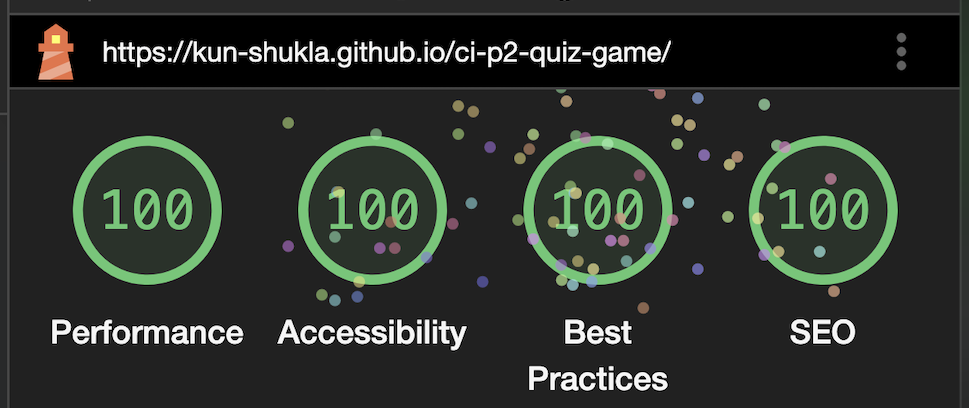
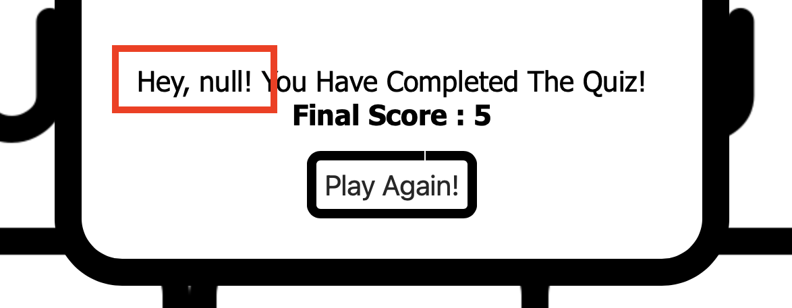

# Wildlife Quiz Game

This web application is a quiz game based on a wildlife theme. The quiz consists of 10 randomly displayed questions with four possible answers to choose from. This app has been built for entertainment and has been designed for users of all age groups with its straightforward, simple-to-use and responsive one-page design. 

The live link can be found here - [Wildlife Quiz Game](https://kun-shukla.github.io/ci-p2-quiz-game/)


[Image Source - Am I Responsive](https://ui.dev/amiresponsive)

## Design
The app's black and white colour theme gives a simple and striking look and feel to the interface. In addition to this, the catchy background 'QUIZ' image is meant to further enhance a positive emotional experience for the user.

## Features

### Pre-game screen



The opening screen is a user prompt for entering a name. The name once inputted is stored and is displayed at the end of the game along with the user's final score.

### Game screen



The quiz features an easy-to-use, intuitive UI. The appealing background 'wallpaper' effect provides a fun and playful look and feel and ties in well with the app's entertainment purpose. The user is presented with four answer options to choose from - each option (which is a label tag, with the corresponding radio buttons hidden), when hovered over with the mouse pointer, provides visual feedback and acts as a call-to-action. If the 'Submit Answer' button is clicked on, without choosing any of the options, a default browser prompt is triggered indicating to the user that they need to choose an option before proceeding. There is also a 'refresh' button at the bottom that allows users to restart the game if they so wish to.

### Answer feedback 



Once the user has clicked on the 'Submit answer' button (in the previous screenshot), the selected option displays either a green 'tick' or red 'cross' indicating a right or wrong answer respectively. If the answer is correct the 'current score' is incremented by 1. In addition, the 'Submit Answer' button is no longer displayed and is replaced by a 'next question' button (therefore preventing an accidental click). On clicking the 'next question' button the next question is displayed and the 'question counter' below the 'Play the Quiz' heading increments by 1.

### 'End of game' Screen



Once the last question has been answered (depicting an incorrect answer in this example) the question counter display text changes to 'quiz complete'. Further down, the user inputted name is displayed along with a message displaying their final score. In addition to this, the 'next question' and 'refresh' buttons are replaced with a 'play again!' button. 

### Potential Future Developments
- A feature for users to be notified of the correct answer in case they choose incorrectly.
- Updating the initial username prompt to a 'landing' screen where users will be able to not only enter their name but also read an introductory message about the game and how to play, and potentially choose from multiple categories (as detailed below)
- Multiple categories feature - In time, users will have the option to choose from a selection of quiz categories i.e.Sports, Film, Tech etc. Therefore making the game appealing to a wider user base.
- A login feature - users will be able to retrieve a record of their past scores etc.

## Testing

### Validator Testing

- #### HTML
  - No errors were returned when passing through the official W3C Markup Validator
    
- #### CSS

  - No errors were found when passing through the official W3C CSS Validator
    

- #### Accessibility
  - The site achieved a Lighthouse (Chrome Dev tools) accessibility score of 100% which confirms that the colors and fonts chosen are easy to read and accessible
    

### Browser Testing

- The web page was tested on Google Chrome, Safari, Firefox and Microsoft Edge web browsers with no issues observed.

### Device Testing and responsiveness

- The website was viewed on a variety of devices such as Desktop, Laptop and mobile devices to ensure responsiveness across a range of different screen sizes. The website performed as intended. Responsiveness was also checked extensively via Chrome developer tools across multiple device screen dimensions with no errors observed.

### Solved Bugs

#### Issue regarding the randomized nested 'choices' array

- A bug was detected relating to the nested answer choices array. These 'choices' are being randomly displayed using the 'shuffle' function. Before the shuffle function is called the correct answer always appears at position [0] of the original array. This value is assigned to the variable 'correctAnswer' so that it can be used to check answers chosen by the user. When the choices are shuffled the user selected option is checked against that stored correct value. This however was throwing an error from time to time as the array once shuffled was then being used in place of the original array to reference the position [0] element which was no longer the value of the correct answer.
- To get around this problem the splice function was used to remove questions already displayed and therefore the above issue was effectively bypassed.

#### Issue related to the 'Next question' button not behaving as intended
- Another bug that was discovered had to do with an issue relating to how the 'NextQButton' listener was behaving. Clicking this button appeared to trigger the 'event listener' associated with the 'Submit' button instead.
- This was resolved  by simply removing the 'next question' button from within the form tag so that just the 'submit' button was within the form.

#### Form validation did not work when the user clicked on the 'submit' button without selecting an option first
- To make the UI look more appealing the radio button input tags were set to 'display: none' with only the associated label tag values displayed on the screen. This led to an issue whereby there was no longer a browser-generated prompt asking users to select one of the four options before submitting the form (as this validation mechanism is attached to the input tags which were now hidden).
- I initially attempted to use JS borrowed from an online resource to try to tackle this problem however it did not work for me. On further research, I came across a simple piece of CSS to fix this which allowed for the input tag's normal functionality to be maintained whilst keeping the radio buttons hidden (without using any layout space), as shown in the below code snippet - 
```
input {
position: fixed;
opacity: 0;
pointer-events: none;
}

```

### Known bugs
- The prompt for asking users to enter their name before the start of the game can be left blank by either clicking the 'cancel' / 'ok' buttons or the 'Esc' key. This leads to a bug whereby the username appears as 'null' when the final score is shown, as shown below - 
 

 ## Technologies Used
- Javascript
- CSS
- HTML5

### Programs / Tools Used
- [Chrome Dev Tools](https://developer.chrome.com/docs/devtools/) - Used for overall development and troubleshooting. As well as for testing responsiveness and site performance scores (Lighthouse)
- [GitHub](https://github.com/) - Used for version control and deployment.
- [Visual Studio Code](https://code.visualstudio.com) - Used as the code editor.
- [W3C](https://www.w3.org/) - Used for HTML & CSS Validation.

## Deployment

The project was deployed using GitHub Pages. The steps to deploy using GitHub Pages are as follows:

1. Go to the repository on GitHub.com
2. Select 'Settings' near the top of the page.
3. Select 'Pages' from the menu bar on the left of the page.
4. Under 'Build and deployment' > 'Branch', select the 'main' branch from the dropdown menu.
5. Once selected, click the 'Save' button.
6. Deployment should be confirmed by a message on a green background saying "Your site is published at" followed by the web address.

The live link can be found here - [Wildlife Quiz Game](https://kun-shukla.github.io/ci-p2-quiz-game/)

### Media

All media files were sourced from the below websites and attributed to the following photographers:

- [Am I Responsive](http://ami.responsivedesign.is/) - for the Readme file's hero image depicting a mock-up of how the web page looks across different device screen sizes.
- [Flaticon (Freepik Company)](https://www.flaticon.com) - for the site's favicon and background 'wallpaper' images.
- [Font Awesome](https://fontawesome.com/) - Used for the 'restart game' icon.

### Online Resources Used

- [ChatGPT](https://chat.openai.com) - Used for at times for troubleshooting related queries
- [Stack Overflow](https://stackoverflow.com/)
- [W3Schools](https://www.w3schools.com/)

## Acknowledgments / Credits

- [Fisher-Yates 'Shuffle' function](https://bost.ocks.org/mike/shuffle/) - Mike Bockstock's website

- The Code Institute's 'JS Essentials' module helped me to grasp basic JS concepts and apply them to this project.

- Special thanks to course instructor Komal Karir for his invaluable input especially during the formulation of the project idea. Also, to my classmate Hoi Him Kwan for his support and input whilst building the project.
