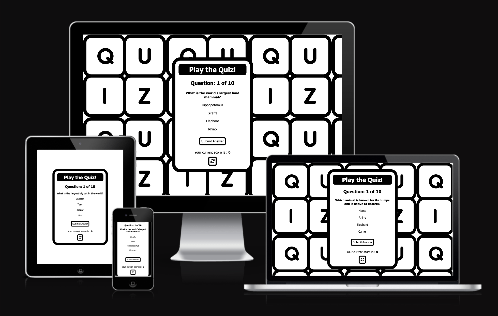

# Wildlife quiz-game

This web application is a quiz game based on a wildlife theme. The quiz consists of 10 randomly displayed questions with four possible answers to choose from. This app has been built for purposes of entertainment and has been designed for users of all age groups with its straight forward, simple-to-use and responsive one-page design. 

The live link can be found here - [Wildlife Quiz Game](https://kun-shukla.github.io/ci-p2-quiz-game/)

[Image Source - Am I Responsive](https://ui.dev/amiresponsive)

## Design
The app's black and white color theme gives a simple and striking look and feel to the interface. In addition to this, the catchy background 'QUIZ' image is meant to further enhance a positive emotional experience for the user.

## Features

### Pre-game screen

The opening screen is a user prompt for entering a name. The name once inputted is stored and is displayed at the end of the game alongwith the user's final score.

### Game screen

The quiz features an easy to use, intuitive UI. The appealing background 'wallpaper' effect provides a fun and playful look and feel and ties in well with the app's purpose to entertain. The user is presented with four answer options to choose from - each option (which is actually a label tag, with the corresponding radio buttons hidden), when hovered over with the mouse pointer, provides visual feedback and acts as a call-to-action. If the 'Submit Answer' button is clicked on without choosing any of the options a default browser prompt is triggered indicating to the user that they need to choose an option before proceeding. There is also a 'refresh' button at the bottom which allows users to restart the game if they so wish to.

### Answer feedback 

Once the user has clicked on the 'Submit answer' button (in the previous screenshot), the selected option displays either a green 'tick' or red 'cross' indicating a right or wrong answer respectively. If the answer is correct the 'current score' is incremented by 1. In addition, the 'Submit Answer' button is no longer displayed and is replaced by a 'next question' button (therefore preventing an accidental click). On clicking the 'next question' button the next question is displayed and the 'question counter' below the 'Play the Quiz' heading increments by 1.

### 'End of game' Screen

Once the last question has been answered (depicting an incorrect answer in this example) the question counter display text changes to 'quiz complete', below the user inputted name is displayed along with a message displaying thier final score. In addition to this, the 'next question' and 'refresh' buttons are replaced with a 'play again!' button. 

### Potential Future Developements
- A feature for users to be notified of the correct answer incase they choose incorrectly.
- Updating the intial username prompt to a 'landing' screen where users will be able to not only enter thier name but also read an introdutory message about the game and how to play, and potentially choose from mutiple categores (as detailed below)
- Mutliple categories feature - In time users will have the option to choose from a selection of quiz categories i.e.Sports, Film, Tech etc. Therefore making the game appealing to a wider user base.
- A login feature - whereby users can retrieve a record of their past scores etc.

## Testing

### Validator Testing

- #### HTML
  - No errors were returned when passing through the official W3C Markup Validator
    
- #### CSS

  - No errors were found when passing through the official W3C CSS Validator
    

- #### Accessibility
- The site achieved a Lighthouse (Chrome Dev tools) accessibility score of 94% which confirms that the colours and fonts chosen are easy to read and accessible
    

